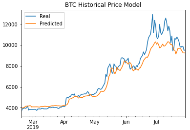
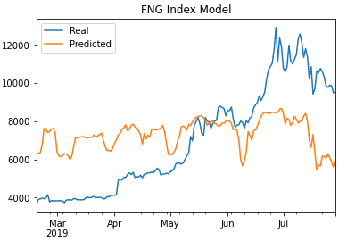

# LSTM BTC Price Predictor
This repository contains scripts for two deep learning recurrent neural network models for BTC closing prices. The first model uses historical BTC prices, while the second uses the Fear and Greed (FNG) Index.

The models both have the following architecture to allow for comparison:

- 3-day window size;
- 20% dropout fraction;
- 3 hidden layers;
- 20 epochs; and
- batch size of 3.

The above parameters were tuned based on model fitting.

The following questions were answered based on the two models:
1. Which model has a lower loss?

    The historical BTC prices model has a lower loss (0.0088) compared to the FNG Index model (0.0973). This makes sense, given how each model tracks the actual BTC price as discussed below in the next question.

2. Which model tracks the actual values better over time?

    As shown below, the model based on historical BTC prices tracked actual BTC prices better over time (both with and without parameter tuning) than the model based on the FNG Index. The historical BTC price model tracked well for much of the data but under-predicted the price during the period of late June to mid-July. Tuning the above parameters mostly only benefited one of the models at a time, mainly the BTC historical price model. The FNG Index model poorly predicted the actual BTC price during virtually the entire data set.

    

3. Which window size works best for the model?

    Based on the model tuning, the optimal window size was determined to be 3 when combined with the other parameters above.

